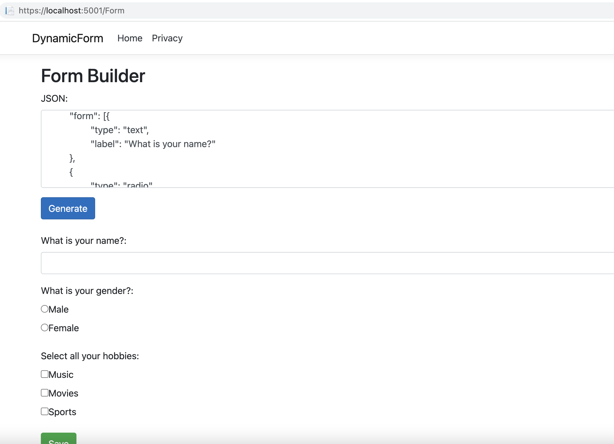

# Dynamic Form Builder
### Steps to Run Application
1. Clone the repository
2. Open project in the Visual Studio IDE
3. Run the Application
4. Navigate to `/Form` Path for e.g `http://localhost:5001/Form` where `5001` is default running port

### Output

